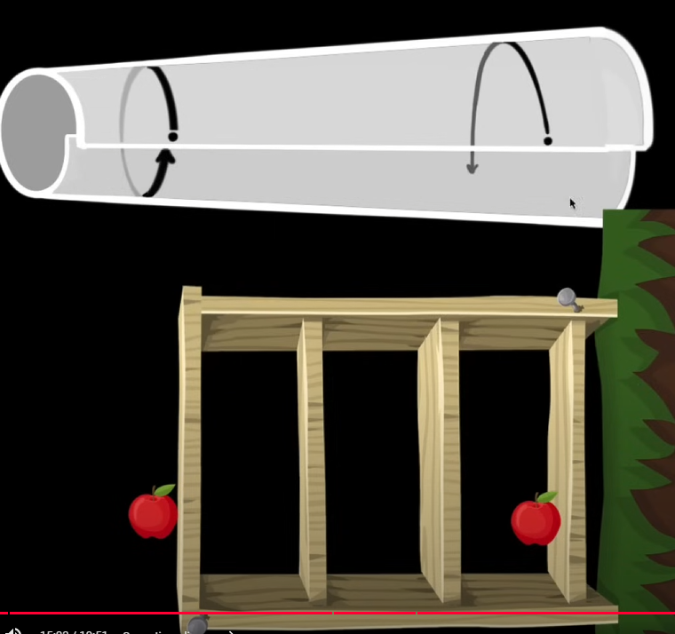
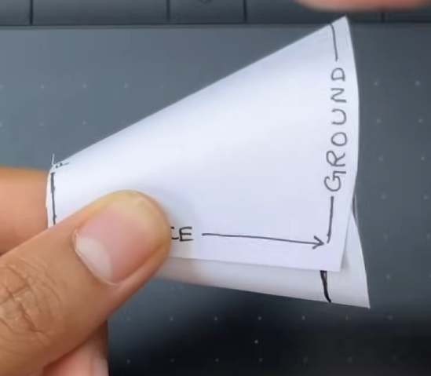
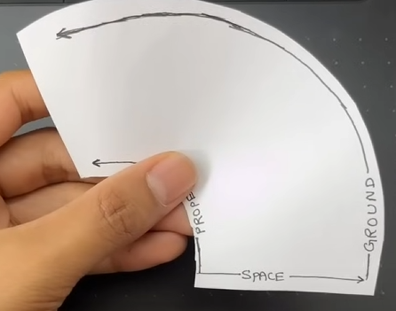

# General Relativity

Now let's bring our understanding of relative to the general case where there
could be a gravity well nearby (aka _general_ relativity).

General Relativity is a theory of gravity that describes how gravity affects the
curvature of spacetime. It builds on the principles of Special Relativity,
following the natural consequences of the constancy of the speed of light
further and leading to the emergence of gravity and the idea that space and time
are not independent axes, but rather our reference frames are composed of a
continuous _spacetime_.

## Curved time creates gravity

### Reframing our understanding of gravity

In Newtonian physics, gravity is a force that pulls objects together. On Earth,
this would look like a uniform force acting on all objects pulling them towards
the ground. But our exploration of Einstein's postulate on
[inertial reference frames](relativity/00-index.md#inertial-reference-frames)
showed us that we can "flip" our reference frame and the physics are the same
By this definition it is impossible to tell if you are at rest or in motion. So
taking that to the extreme, maybe you are at rest and the Earth is accelerating
upwards towards you!

Now consider a photon. It travels in a straight line in space. In the reference
frame where Earth is accelerating upwards, after a moment the photon is still
traveling in a straight line but the ground is closer to it. More time passes
and eventually the ground intersects the photon's path. From the perspective of
the Earth, it looks like the photon is bending towards the ground!

Video: [Gravity bends light even though it has no mass](https://www.youtube.com/watch?v=05jFhuRs-w0&t)

Now let's get a laser and trace the path of its photons in the Earth's reference
frame. We observe that the photons are bent towards the ground, like before.

This time let's measure the path of a photon at the top of the beam and at the
bottom. To us, it appears that the photon at the top takes a longer path to
reach the ground compared to the bottom photon. Our special relativity
intuitions remind us that the speed of light is constant, so time must be slower
for the top photon compared to the bottom photon. This is called [gravitational
time dilation](https://en.wikipedia.org/wiki/Gravitational_time_dilation).

I find this explanation profoundly unsatisfying. We can do better.

### Geometric explanation

A more intuitive way to think about it is to think about it geometrically.

I don't have the time or skills to make a beautiful animation for this, but the
following video does an excellent job of explaining it:

Video: [Gravity comes from time curving space](https://youtu.be/OpOER8Eec2A)

## Curved spacetime

A key insight that will help us later is to understand that this definition
holds true _even if we morph the reference frame_. So on the grid, an object
would still move from point A to point B with respect to the reference frame.
This is what we mean when we say that _curved_---all objects move along straight
lines unless acted upon by a force, but the grid itself is getting morphed by
gravity.

Video: [Curved spacetime changes trajectories of light and
matter](https://www.youtube.com/watch?v=S78h8zQwQe0)
