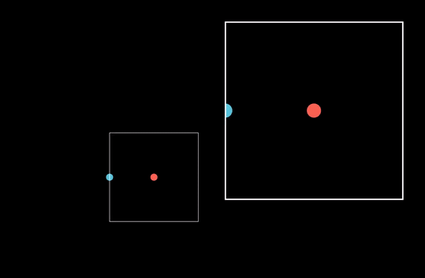

# Special Relativity

## Inertial reference frames

The first key insight is to approach the problem with the understanding that
motion is relative to the inertial reference frame of the observer.

```admonish cite
An **inertial reference frame** is a frame of reference in which a body at rest
remains at rest and a body in motion moves at a constant speed in a straight
line unless acted upon by an outside force.
([source](https://openstax.org/books/university-physics-volume-3/pages/5-1-invariance-of-physical-laws))
```

In other words, in an inertial reference frame attached to an object that is
not accelerating, it is impossible to tell if the object is at rest or moving at
a constant velocity.

```admonish example
A blue dot is floating in interstellar space. The only object in sight is a red
dot. The red dot is moving at a constant angular velocity around the blue dot.

**Problem**: Is the blue dot moving around the red dot, or is the red dot moving
around the blue dot?



**Solution**: Trick question---the physics works the same way in both cases!
```

## The speed of light is constant

```admonish important
**The distance a photon travels in a given amount of time is constant in every
inertial reference frame.**

$$
\text{speed}
= \frac{\text{distance traveled}}{\text{elapsed time}} =
\frac{\text{meters}}{\text{seconds}}
\\
\quad
\\
c = 299792458 \text{ m/s}
$$
```

This statement is
[more complicated](https://www.youtube.com/watch?v=ZbGxXyqlhbU&t=187s) than it
seems, but that's a tale for another time.

- $c$ is defined as the distance traveled by a photon in 1 second.
- $c$ is _not a measurement_, it is a _definition_. In actuality, the definition
  of $1 \text{ meter}$ is defined as the distance light travels in
  $\frac{1}{299792458}$ seconds.
- Science has accepted that this value, $299792458 \text{ m/s}$, is what we have
  decided to call the speed of light.

It is key to pin the definition of $c$ this way because as we will see later,
distance and time are _not absolute_, they are _relative_. The time or distance
can change depending on the observer's reference frame, but **distance traveled
by a photon divided by elapsed time is always $c$.**
