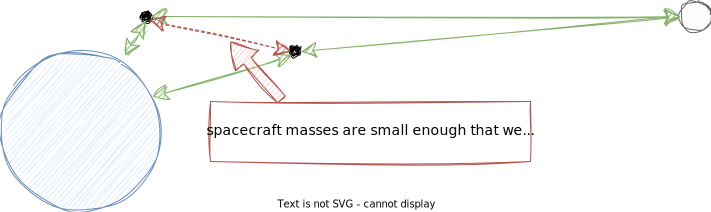

# celestial bodies
Positions and velocities of celestial bodies are not calculated by the simulation. Instead, a trusted almanac is used to
determine a body's position & velocity at a given time epoch in the solar system coordinate frame.

## almanac
[ANISE](https://github.com/nyx-space/anise) or [Nyx](https://github.com/nyx-space/nyx).

# spacecraft
Spacecraft trajectories are calculated on-the-fly using n-body physics, but the spacecraft is only influenced by
potential fields of celestial bodies (not other spacecraft).

## algorithm
Brute force pairs via [particular](https://particular.rs/).