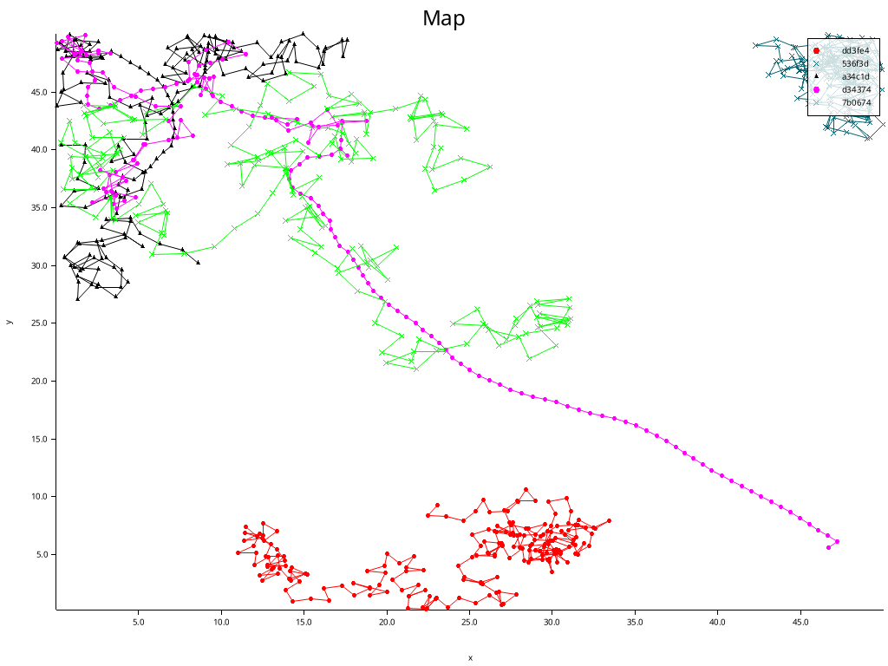
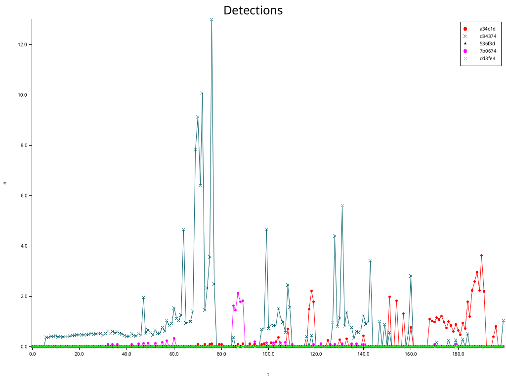
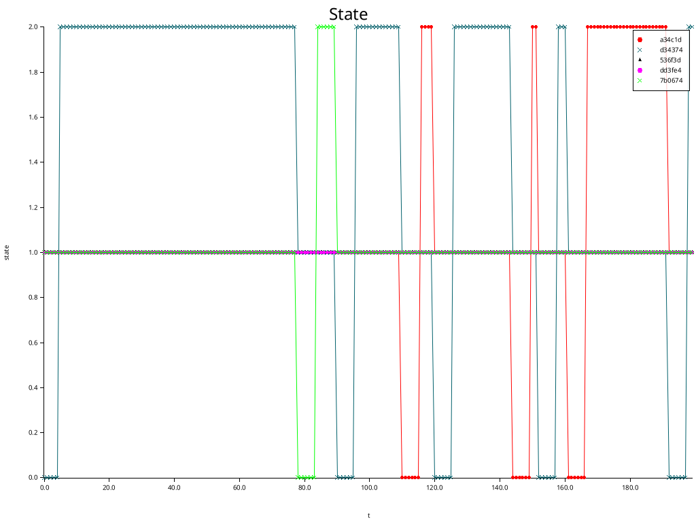

# marcopolo-rs

This is a demo of Marco Polo implemented as an agent based model in Rust. The
Python counterpart can be found at [learning/demos/marcopolo/](./marcopolo/).






(0 -> "frozen" or waiting, 1 -> running away ("not it"), 2 -> chasing others ("it"))

This readme is a guide to running the demo starting from scratch.

## Set up Rust

For a thorough walkthrough, check the official Rust [getting started](https://www.rust-lang.org/learn/get-started) page.

1. Install `rustup`. This is the tool that manages and updates Rust on your machine.

```shell
# download and run the rustup installer shell script
curl --proto '=https' --tlsv1.2 -sSf https://sh.rustup.rs | sh
```

2. Add `~/.cargo/bin` to your PATH. This is where things installed by the Rust
toolchain are installed. Adding it to your path will make these tools accessible
from the terminal.

3. Restart your shell and confirm Rust is installed with the terminal command `rustc --version`.

## Set up the demo

1. Set the root folder of the demo (`clocss-abm/learning/demos/marcopolo-rs/`)
as your working directory. It is a self contained project.
2. Build this project. The dependencies for this demo are installed alongside
the project when you build it, so any OS-specific idiosyncrasies should pop up
at this step.

```shell
# install and compile the project and its dependencies
cargo build
```

3. Now you can fiddle with the model. The knobs you can play with are all set in [`main.rs`](src/main.rs).
Save this file when you are done.

```rust
// knobs to play with
pub static NUMBER_OF_AGENTS: u32 = 5;
pub static TIMESTEPS_TO_SIMULATE: u64 = 200;
pub static ITERATIONS: u64 = 3;
pub static SAVE_OUTPUT: bool = true;
pub static SCALE: f32 = 1.0;
```

## Run the demo

1. Run the project from the terminal. It will spawn a UI in your terminal window
that you can use to inspect the model as it runs.

```shell
cargo run
```

2. To stop execution, kill the process with `Ctrl+C`.
